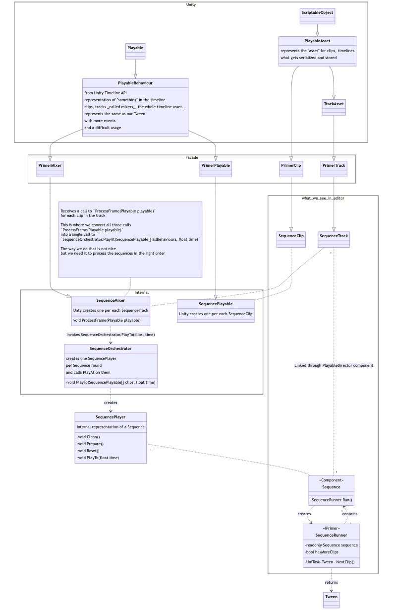

# Primer.Timeline

This package provides a layer on top of `Unity.Timeline` in an attempt to simplify it's usage and make it closer to a video editor.

It provides a facade on top of `Unity.Timeline`, that includes

- `PrimerTrack`
- `PrimerClip`
- `PrimerPlayable`
- `PrimerPlayable&lt;TTrackBind&gt;`
- `PrimerMixer`

And a primary utility: the `Sequence`.

## Structure

## Sequence

This class represents a sequence of animations defined via code.
It's used by extending the class and overriding `IEnumerable&lt;Tween&gt; Define()`.
Each returned Tween will become a clip in the timeline.

## Facade

### PrimerTrack

Base class for tracks.

### PrimerClip

Base class for clips.
`PrimerPlayable template { get; }` must be implemented when extending this.
Has code dedicated to know what Component is bound to the track of this clip.

### PrimerPlayable

Provides virtual `Start()` and `Stop()` methods that are much simpler to understand than the various `PlayableBehaviour` virtual methods.

`ProcessFrame` must be overriden and `base.ProcessFrame()` invoked inside.

Has plenty of code dedicated to communication with the mixer for various internal requirements.

### PrimerPlayable&lt;TTrackBind&gt;

Extension of `PrimerPlayable` that includes `TTrackBind trackTarget` property containing the Component is bound to the track of this playable, this is set before `Start()` is invoked so it's safe to use from `Start()`, `Stop()` and after invoking `base.ProcessFrame()`

### PrimerMixer

A mixer will collect the states of multiple clips and decide how to mix them together and execute them.
